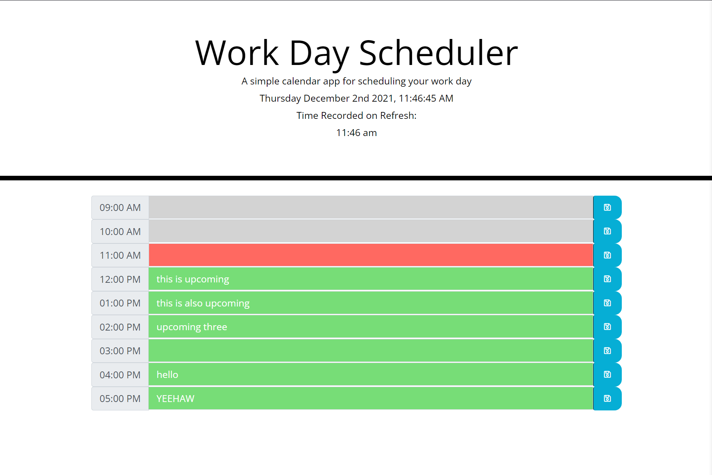
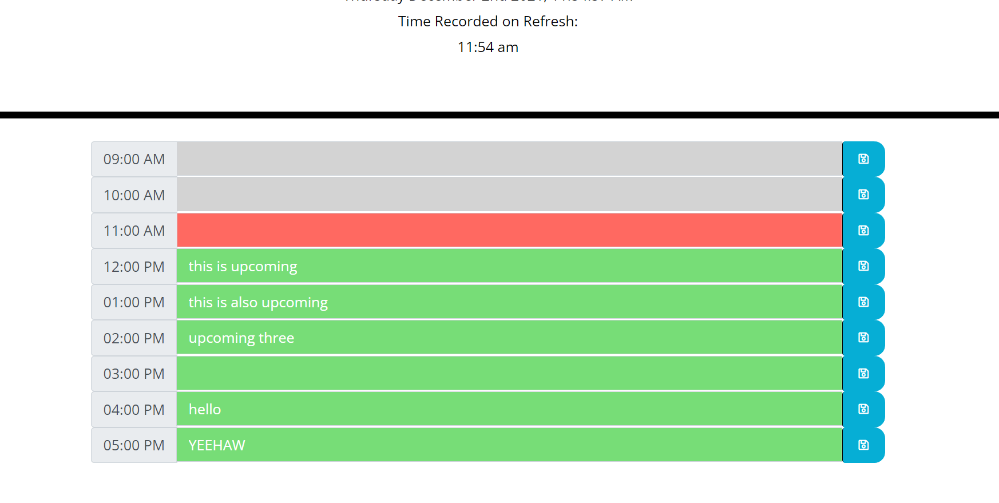

# HW5-Work-Day-Scheduler

## Link to deployed application
https://awonka.github.io/HW5-Work-Day-Scheduler/
## Usage Guide

When arriving to the page you will find a real time timer and below that a recorded time. The purpose of the real time timer is so you can see how much time has passed since the recorded time. The recorded time was the current time of when the page was loaded/re-loaded. This is so you can know what is considered past, present, or future in the day-scheduler forms.

The above screenshot shows the first form on the day-scheduler. The left part shows the time for that form, the middle is in the input field where you need to type what you want to schedule for that time, and the blue button is the save icon for saving whatever you typed in the input field into localstorage.

In the above screenshot at the top you will see the recorded time on Refresh. This is so you will know what is past, present, and future in the time slots on the forms. The forms are also color coordinated to represent this as well. The grayed out forms represent times that have already past, red signifies what is present, as you see the recorded time says 11:54 AM and the present field in red is 11:00 AM, signifying that we are currently in that allotted hour. 

The green fields signify future(upcoming) events so you can know what is yet to come on your day-scheduler.